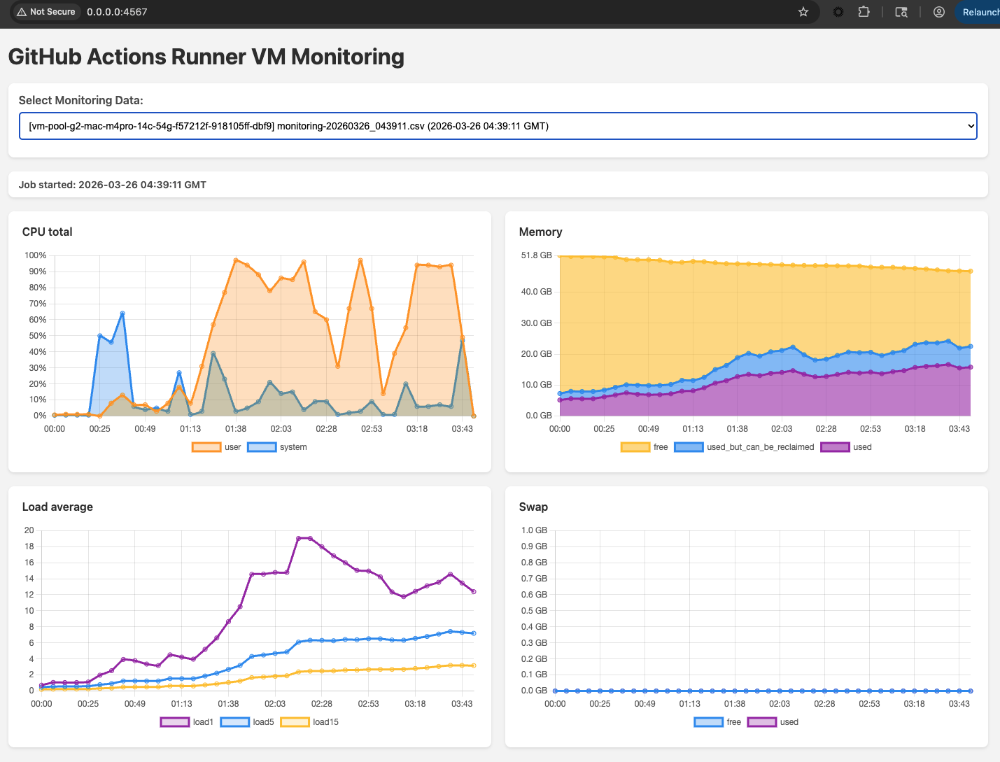

# GitHub Actions Runner VM Monitoring

Monitor CPU, memory, load, and swap on Bitrise-hosted GitHub Actions Mac runners. Metrics are automatically collected during each job, pushed to this repo, and visualised in a local Ruby web app.

---

## Quick Start

### 1. Fork this repo

Fork `naveen-bitrise/Bitrise-GHA-Runner-VM-Monitoring` to your own GitHub account or org.

### 2. Create a Fine-Grained PAT

Go to **GitHub → Settings → Developer settings → Personal access tokens → Fine-grained tokens → Generate new token**:

- **Repository access**: only this forked repo
- **Permissions → Contents**: `Read and write`

### 3. Add the warmup script to your Bitrise Runner Pool

Copy the contents of `warmup_runner.sh` and paste it into your Bitrise Runner Pool warmup script configuration.

### 4. Replace the repo URL and PAT placeholder

**4a.** Replace the repo URL with your forked repo (currently set to `naveen-bitrise/Bitrise-GHA-Runner-VM-Monitoring`):
```
MONITORING_REPO="YOUR_ORG/YOUR_FORKED_REPO"
```

**4b.** Replace `METRICS_TOKEN_PLACEHOLDER` with the Fine-Grained PAT you created in step 2:
```
METRICS_TOKEN="github_pat_xxxx..."
```

### 5. Run a GHA job on the Bitrise runner

Trigger any GitHub Actions workflow that runs on your Bitrise runner pool. When the job finishes, the runner hook automatically uploads the metrics CSV to the `metrics/` folder in this repo.

### 6. Pull the latest metrics

If you already have the repo cloned locally, pull main to get the new metrics file:

```bash
git pull origin main
```

If not, clone the repo first:

```bash
git clone https://github.com/YOUR_ORG/YOUR_REPO.git
```

### 7. Start the web app

```bash
cd webapp
bash start.sh
```

`start.sh` will automatically install Ruby dependencies on first run.

### 8. Open the dashboard

Open [http://0.0.0.0:4567](http://0.0.0.0:4567) in your browser. Select a job from the dropdown to view its metrics.



---

## Dashboard Charts

The dashboard shows four charts for the duration of the selected job. The x-axis on all charts shows elapsed time (MM:SS) from job start. The job start timestamp (GMT) is shown above the charts.

### CPU Total

Shows CPU usage as a percentage over time.

- **user** — CPU time spent running user-space processes (your build steps, compilers, test runners etc.)
- **system** — CPU time spent in the kernel (I/O, process management, system calls)

High `user` spikes indicate compute-heavy build steps. High `system` may indicate heavy file I/O or process spawning.

### Memory

Stacked area chart showing how physical RAM is distributed across the job.

- **used** — memory actively in use by processes
- **used_but_can_be_reclaimed** — cached/reclaimable memory (file cache, buffers) — macOS will reclaim this if needed
- **free** — completely unused memory

The y-axis max reflects the total RAM on the runner. A growing `used` band with shrinking `free` indicates memory pressure.

### Load Average

Shows the system load average over three rolling windows.

- **load1** — 1-minute load average (most responsive to sudden spikes)
- **load5** — 5-minute load average
- **load15** — 15-minute load average (smoothed long-term trend)

Load average represents the number of processes waiting for CPU time. On a 14-core runner, values below 14 generally indicate the system is not CPU-saturated.

### Swap

Shows swap space usage in GB.

- **used** — how much swap is currently in use
- **free** — remaining swap capacity

Swap usage indicates the system ran low on physical RAM and started paging to disk, which significantly slows builds. A flat line near 0 GB is ideal.

---

## Architecture

```
┌─────────────────────────────────────────────────────────┐
│  Bitrise VM Boot                                        │
│                                                         │
│  warmup_runner.sh runs:                                 │
│    1. Clones this repo                                  │
│    2. Installs collect_metrics.sh + monitor_daemon.sh   │
│    3. Writes daemon.env (repo + PAT credentials)        │
│    4. Registers push_metrics_hook.sh as                 │
│       ACTIONS_RUNNER_HOOK_JOB_COMPLETED                 │
│    5. Starts monitor_daemon.sh in background            │
└───────────────────────┬─────────────────────────────────┘
                        │
                        ▼
┌─────────────────────────────────────────────────────────┐
│  GHA Job Running                                        │
│                                                         │
│  monitor_daemon.sh polls every 5s for Runner.Worker     │
│    → detects job start                                  │
│    → starts collect_metrics.sh                          │
│    → collects CPU, memory, load, swap every 5s          │
│    → writes to /tmp/gha-monitoring/monitoring-*.csv     │
└───────────────────────┬─────────────────────────────────┘
                        │
                        ▼
┌─────────────────────────────────────────────────────────┐
│  GHA Job Completes                                      │
│                                                         │
│  GHA runner invokes push_metrics_hook.sh:               │
│    → finds latest CSV in /tmp/gha-monitoring/           │
│    → clones this repo                                   │
│    → copies CSV to metrics/<vm-name>/                   │
│    → commits and pushes to main                         │
│                                                         │
│  VM is then destroyed                                   │
└───────────────────────┬─────────────────────────────────┘
                        │
                        ▼
┌─────────────────────────────────────────────────────────┐
│  Local Machine                                          │
│                                                         │
│  git pull → metrics/<vm-name>/monitoring-*.csv          │
│                                                         │
│  cd webapp && bash start.sh                             │
│    → Sinatra app reads metrics/ folder                  │
│    → Serves 4 interactive charts at :4567               │
└─────────────────────────────────────────────────────────┘
```

### Key Files

| File | Purpose |
|---|---|
| `warmup_runner.sh` | VM boot script — installs monitoring and starts the daemon |
| `install_on_runner.sh` | Copies scripts to `/usr/local/bin/gha-monitoring/` |
| `monitor_daemon.sh` | Background daemon — detects GHA jobs and starts/stops collection |
| `collect_metrics.sh` | Samples CPU, memory, load, swap every 5s and writes CSV |
| `push_metrics_hook.sh` | GHA post-job hook — pushes the CSV to this repo |
| `metrics/<vm-name>/` | One subfolder per runner VM, one CSV per job |
| `webapp/app.rb` | Sinatra web app — serves the dashboard |
| `webapp/views/index.erb` | Dashboard UI with Chart.js graphs |

---

## Requirements

### Runner (macOS)
- Bash 3.2+
- Standard macOS utilities: `iostat`, `vm_stat`, `sysctl`, `pagesize`
- Git (for pushing metrics)

### Local machine (webapp)
- Ruby 2.7+
- Bundler (`gem install bundler`)

---

## Troubleshooting

**Metrics not being pushed after job**
Check that `ACTIONS_RUNNER_HOOK_JOB_COMPLETED` was written to `/Users/vagrant/actions-runner/.env`:
```bash
cat /Users/vagrant/actions-runner/.env
```

**Daemon not detecting jobs**
Check daemon logs on the runner:
```bash
tail -f /tmp/gha-monitoring/daemon.log
```

**Push fails with auth error**
Verify `METRICS_TOKEN` in `/usr/local/bin/gha-monitoring/daemon.env` matches a valid PAT with `Contents: Read and write` on this repo.

**Web app shows no files**
Confirm you have pulled the latest main branch and that CSV files exist under `metrics/`:
```bash
ls metrics/
```
