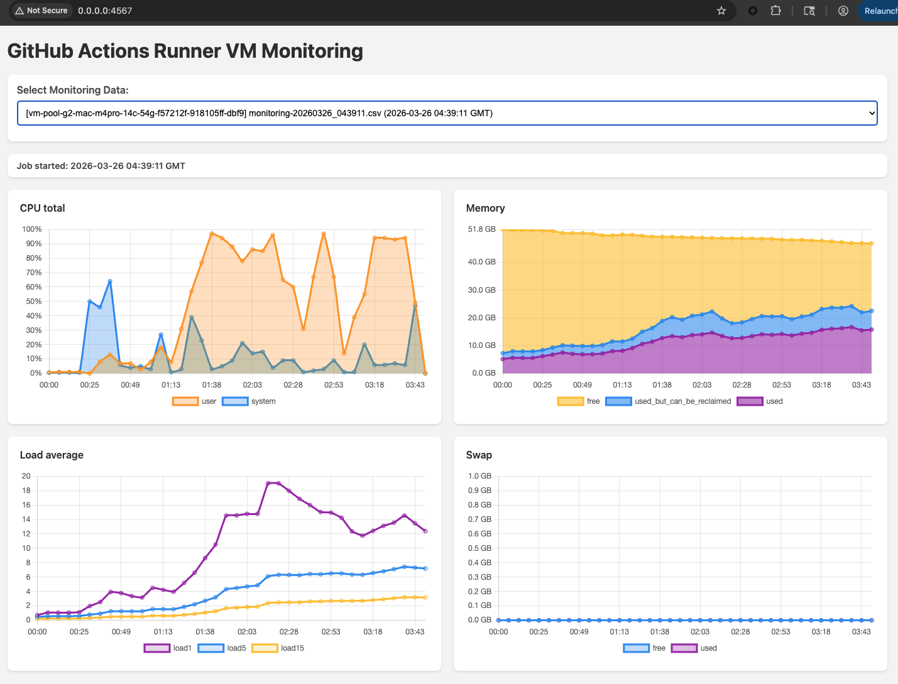

# GitHub Actions Runner VM Monitoring

Monitor CPU, memory, load, and swap on Bitrise-hosted GitHub Actions Mac runners. Metrics are collected during each job and, when the job finishes, posted as charts to the job's **summary page** and **log** — no token, no repo pushes, no extra services.

---

## Quick Start

### 1. Add the warmup script to your Bitrise Runner Pool

Copy the contents of `warmup_runner.sh` into your Bitrise Runner Pool warmup script configuration. If you use a fork, change `MONITORING_REPO` / `MONITORING_BRANCH` to point at it.

### 2. Run a GHA job on the Bitrise runner

Trigger any workflow that runs on the pool. When the job finishes, `job_summary_hook.sh` runs as part of the job and adds:

- **Job summary** (workflow run → *Summary*): a stats table plus Mermaid line charts for CPU, memory, load average and (if used) swap.
- **Job log** (*Complete runner* step → *VM metrics* group): the same stats with ASCII charts.

Charts are capped at 60 points (`MAX_POINTS`); each point is the max of its time bucket so short spikes stay visible.

### 3. (Optional) Local web app

The CSV stays on the VM at `/tmp/gha-monitoring/`. To use the Sinatra dashboard, put CSVs under `metrics/<vm-name>/` locally (e.g. from the `main` branch history) and:

```bash
cd webapp
bash start.sh
```

`start.sh` will automatically install Ruby dependencies on first run.

### 8. Open the dashboard

Open [http://0.0.0.0:4567](http://0.0.0.0:4567) in your browser. Select a job from the dropdown to view its metrics.



---

## Dashboard Charts

The dashboard shows four charts for the duration of the selected job. The x-axis on all charts shows elapsed time (MM:SS) from job start. The job start timestamp (GMT) is shown above the charts.

### CPU Total

Shows CPU usage as a percentage over time.

- **user** — CPU time spent running user-space processes (your build steps, compilers, test runners etc.)
- **system** — CPU time spent in the kernel (I/O, process management, system calls)

High `user` spikes indicate compute-heavy build steps. High `system` may indicate heavy file I/O or process spawning.

### Memory

Stacked area chart showing how physical RAM is distributed across the job.

- **used** — memory actively in use by processes
- **used_but_can_be_reclaimed** — cached/reclaimable memory (file cache, buffers) — macOS will reclaim this if needed
- **free** — completely unused memory

The y-axis max reflects the total RAM on the runner. A growing `used` band with shrinking `free` indicates memory pressure.

### Load Average

Shows the system load average over three rolling windows.

- **load1** — 1-minute load average (most responsive to sudden spikes)
- **load5** — 5-minute load average
- **load15** — 15-minute load average (smoothed long-term trend)

Load average represents the number of processes waiting for CPU time. On a 14-core runner, values below 14 generally indicate the system is not CPU-saturated.

### Swap

Shows swap space usage in GB.

- **used** — how much swap is currently in use
- **free** — remaining swap capacity

Swap usage indicates the system ran low on physical RAM and started paging to disk, which significantly slows builds. A flat line near 0 GB is ideal.

---

## Architecture

```
┌─────────────────────────────────────────────────────────┐
│  Bitrise VM Boot                                        │
│                                                         │
│  warmup_runner.sh runs:                                 │
│    1. Clones this repo (job-summary branch, no token)   │
│    2. Installs collect_metrics.sh + monitor_daemon.sh   │
│    3. Writes daemon.env (VM_NAME)                       │
│    4. Registers job_summary_hook.sh as                  │
│       ACTIONS_RUNNER_HOOK_JOB_COMPLETED                 │
│    5. Starts monitor_daemon.sh in background            │
└───────────────────────┬─────────────────────────────────┘
                        │
                        ▼
┌─────────────────────────────────────────────────────────┐
│  GHA Job Running                                        │
│                                                         │
│  monitor_daemon.sh polls every 5s for Runner.Worker     │
│    → detects job start                                  │
│    → starts collect_metrics.sh                          │
│    → collects CPU, memory, load, swap every 5s          │
│    → writes to /tmp/gha-monitoring/monitoring-*.csv     │
└───────────────────────┬─────────────────────────────────┘
                        │
                        ▼
┌─────────────────────────────────────────────────────────┐
│  GHA Job Completes                                      │
│                                                         │
│  GHA runner invokes job_summary_hook.sh:                │
│    → finds latest CSV in /tmp/gha-monitoring/           │
│    → prints stats + ASCII charts to the job log         │
│    → appends Mermaid charts to $GITHUB_STEP_SUMMARY     │
│                                                         │
│  VM is then destroyed                                   │
└─────────────────────────────────────────────────────────┘
```

### Key Files

| File | Purpose |
|---|---|
| `warmup_runner.sh` | VM boot script — installs monitoring and starts the daemon |
| `install_on_runner.sh` | Copies scripts to `/usr/local/bin/gha-monitoring/` |
| `monitor_daemon.sh` | Background daemon — detects GHA jobs and starts/stops collection |
| `collect_metrics.sh` | Samples CPU, memory, load, swap every 5s and writes CSV |
| `job_summary_hook.sh` | GHA post-job hook — posts metric charts to the job summary and log |
| `metrics/<vm-name>/` | One subfolder per runner VM, one CSV per job |
| `webapp/app.rb` | Sinatra web app — serves the dashboard |
| `webapp/views/index.erb` | Dashboard UI with Chart.js graphs |

---

## Requirements

### Runner (macOS)
- Bash 3.2+
- Standard macOS utilities: `iostat`, `vm_stat`, `sysctl`, `pagesize`
- Git (to clone this repo during warmup)

### Local machine (webapp)
- Ruby 2.7+
- Bundler (`gem install bundler`)

---

## Troubleshooting

**No charts in the job summary**
Check that `ACTIONS_RUNNER_HOOK_JOB_COMPLETED` was written to `/Users/vagrant/actions-runner/.env`:
```bash
cat /Users/vagrant/actions-runner/.env
```

**Daemon not detecting jobs**
Check daemon logs on the runner:
```bash
tail -f /tmp/gha-monitoring/daemon.log
```

**Web app shows no files**
Confirm you have pulled the latest main branch and that CSV files exist under `metrics/`:
```bash
ls metrics/
```
